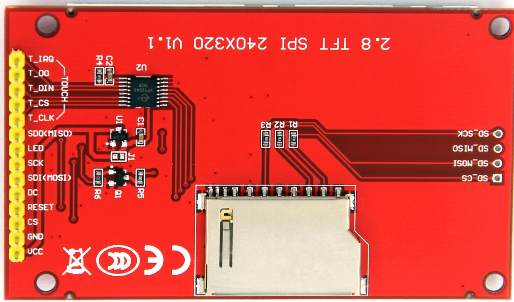

# lvgl_tutorials
Tutorial series about LVGL implementation using Arduino and ESP32

# 2.8inch ILI9341 - Wiring for ESP32

This section provides the wiring guide for connecting a 2.8inch TFT display based on ILI9341 to an ESP32 development board. The table below outlines the pin connections for the display and touch screen functionality (optional). 

## Wiring Table

| Number | TFT Pin Label | ESP32 Pin Label |
|--------|---------------|-----------------|
| 1      | VCC           | 3.3V            |
| 2      | GND           | GND             |
| 3      | CS            | GPIO15          |
| 4      | RESET         | GPIO4           |
| 5      | DC/RS         | GPIO2           |
| 6      | SDI (MOSI)    | GPIO23          |
| 7      | SCK           | GPIO18          |
| 8      | LED           | 3.3V            |
| 9      | SDO (MISO)    | GPIO19          |

### Optional Touch Screen Signal Line Wiring

The following connections are only needed if your module has touch functionality. If not, you can leave these pins unconnected.

| Number | Touch Pin Label | ESP32 Pin Label |
|--------|------------------|-----------------|
| 10     | T_CLK             | GPIO18          |
| 11     | T_CS              | GPIO21          |
| 12     | T_DIN             | GPIO23          |
| 13     | T_DO              | GPIO19          |
| 14     | T_IRQ             | N/C             |

### Notes
- **N/C (Not Connected):** This pin can be left unconnected if not used.
- **3.3V for VCC and LED:** Make sure to supply 3.3V to the VCC and LED pins to avoid damaging the display.

For any additional configurations or troubleshooting, refer to the ESP32 documentation and the TFT display datasheet.